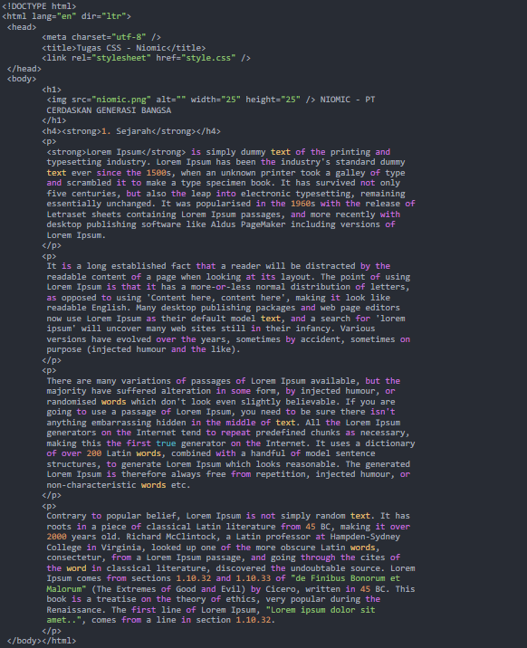
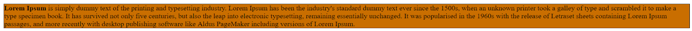
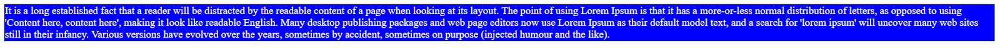
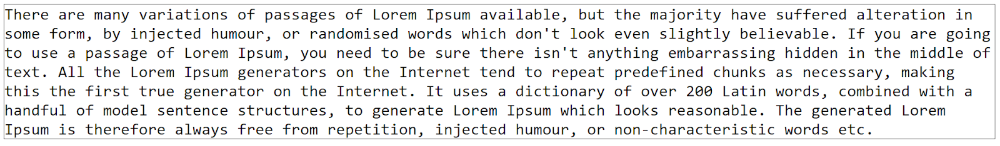
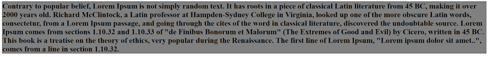
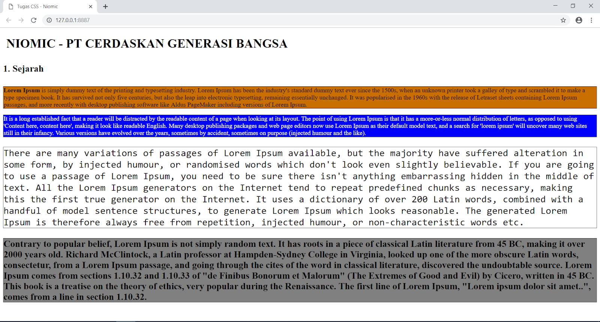

# TUGAS 3 CSS
1. Silahkan tuliskan file HTML ini :  
  
2. Buatlah file css dengan nama “Style.css”  
3. Silahkan lakukan seleksi kepada tag paragraf dan buatlah seperti gambar berikut ini :  
  
4. Buatlah tampilan paragraf pertama sehingga menghasilkan tampilan seperti gambar berikut ini :  
  
5. Buatlah paragraf kedua sehingga menghasilkan tampilan seperti gambar berikut ini :  

6. Buatlah paragraf tiga sehingga menghasilkan tampilan seperti gambar berikut ini :  
  
7. Buatlah paragraf empat sehingga menghasilkan tampilan seperti gambar berikut ini :  
  
8. Ketentuan dalam tugas ini silahkan gunakan property color, font-size, font-weight, dan font-family. untuk pewarnaan background silahkan gunakan property background-color.  
9. Silahkan dijalankan maka hasil yang tertampil akan seperti ini :  
 

